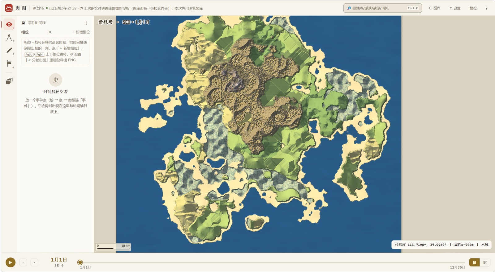

<div align="center">


# Chorograph

[](LICENSE)
[](https://github.com/Lynthar/Chorograph/actions/workflows/test.yml)
[](https://github.com/Lynthar/Chorograph/releases)
[](https://lynthar.github.io/Chorograph/)

</div>

浏览器端分析型世界地图：疆域按纪年演变、A* 寻路算行军天数、战役烘焙成战术兵棋图

我做它是给写小说、搭世界观、复原历史战役的人用的。整个程序是一个 HTML 文件，
数据在你自己机器上，不上传任何服务器。

比起画一张好看的幻想地图，我更在意时间这一维：这里几乎每个对象都带存在时段，
拖动纪年时间轴，城池会换旗、势力范围会伸缩、寻路会按那一年的路网重算。



<sub>一张新建的战术图——海岸、山体与生态带都由种子生成，左下是公里比例尺，
右下是光标处的高程读数，底下那条时间轴细到日与时。</sub>

<!-- 战略示例图：docs/screenshots/strategic.png，重拍后补在这里 -->

## 拿它做什么

**同一张图按年份演变。** 对象带 `since` / `until`，拖时间轴就能看疆域怎么变。
支持自定义历法，也支持真实地球历（儒略 / 格里高利，含公元前）。

**A\* 地形寻路，算的是行军。** 路径吃地形权重，给出里程、迂回率，以及按不同速度档
折算的天数。寻路跑在 Web Worker 里，不卡界面。

**战役烘焙成战术兵棋图。** 战略图上的一个事件点，可以一键展开成小范围的战术图：
时间粒度细到日与时，部队按天走航点，A\* 负责校验可达性。十四类兵种，四类共十六种记号。

**分享与出图。** 一条自带整张图的链接、一个自包含的只读网页、一个演示态，对方不用装
任何东西。通用 GeoJSON 导入用一条管线统一处理 CHGIS、OHM、Azgaar；出图 ×1 到 ×4，PNG 带
pHYs 物理密度，可以直接进印刷流程。

## 安装

**在线版**，打开就能用，也可以装成 PWA：

```
https://lynthar.github.io/Chorograph/
```

**离线单文件**，从 [Releases](https://github.com/Lynthar/Chorograph/releases) 下
`Chorograph.html`，双击就能打开，也可以放在 U 盘里。

**从源码构建**（需要 Node 23.6+）：

```bash
git clone https://github.com/Lynthar/Chorograph.git
cd Chorograph/app
npm ci
npm run build
```

产物是 `app/dist/index.html`。没有配置文件：世界本身的设置（历法、地形种子、图的类型）
存在地图数据里，界面偏好存在浏览器 localStorage。

## 能力边界

- **不支持移动端和触屏。** 这是明确的取舍，不是还没做。
- **文件夹图库只在 Chromium 系浏览器上可用**，因为它依赖 File System Access。
  用别的浏览器会退回 IndexedDB。
- **地形是程序化生成加水文启发式侵蚀，不是地质气候模拟。** 它追求的是可信的制图观感，
  别拿它的地貌当科学结论。
- **行军天数是简化模型。** 选路会吃地形权重，但耗时目前恒等于几何里程除以速度——
  所以走官道绕远反而算出更久。别把那个天数当精确值。
- **只能出 PNG，没有矢量导出。界面只有中文。**
- **离线单文件下有几件事做不了**：导出只读网页要读取自身产物，`file://` 下取不到；
  剪贴板也会退化成手动复制。这些在在线版上都正常。
- **只读分享链接把整张图编码在 URL 里**，大图的链接会很长，可能被聊天软件截断。

## 许可证

GNU Affero 通用公共许可证 v3.0 或更高版本 —— 见 [LICENSE](LICENSE)。
Copyright (c) 2026 Lynthar。
